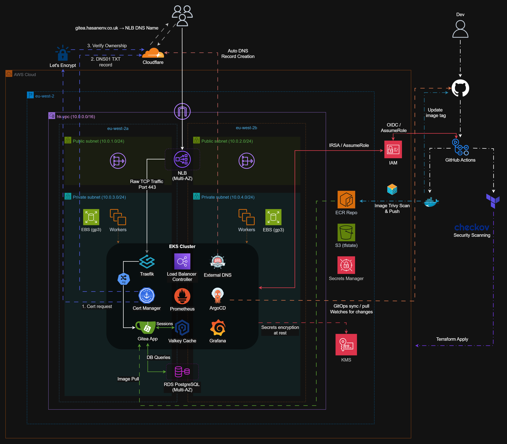
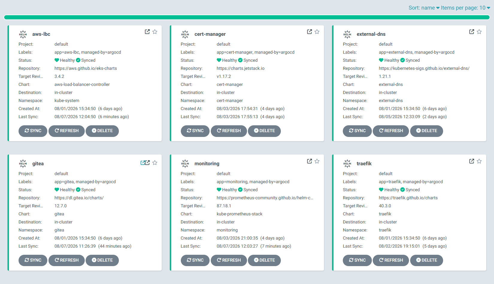
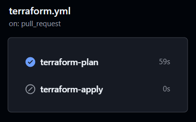
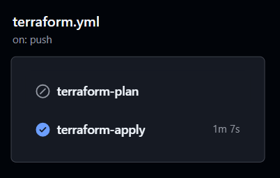
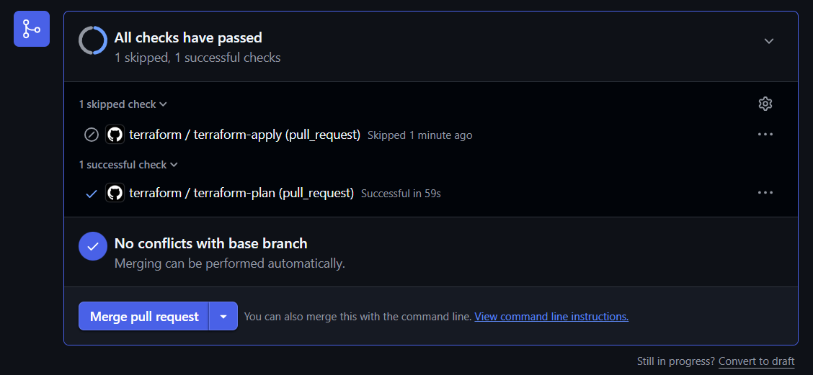
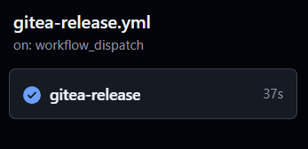
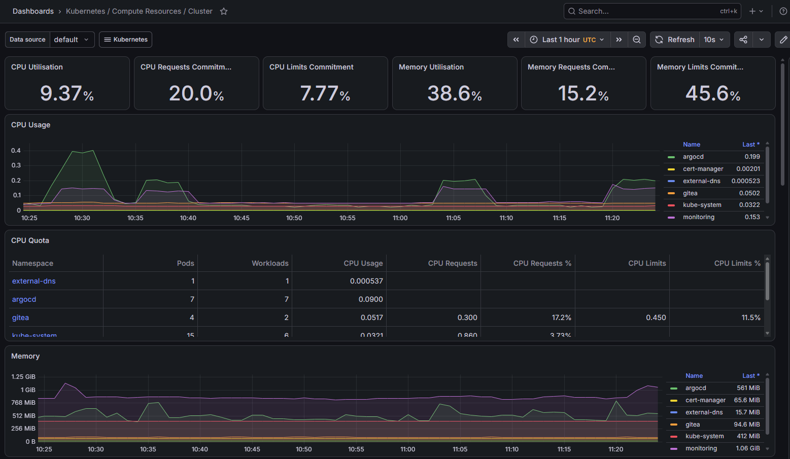

# Self-Hosted Git Platform on Amazon EKS (Terraform, ArgoCD, Helm, GitHub Actions)


<p align="center">
  
</p>

---

## Table of Contents
[comment]: <> (add table here)

## Overview

A production-grade, self-hosted Git platform built on AWS EKS, deploying Gitea as an alternative to cloud-hosted services like GitHub. Designed for organisations that require data sovereignty, regulatory compliance, or cost control at scale, keeping source code within their own infrastructure rather than relying on a third-party platform.

Infrastructure is provisioned via Terraform and deployments are managed through ArgoCD using a GitOps approach. TLS certificates, DNS records, and container image scanning are all automated. Kubernetes provides the self-healing, scalability, and zero-downtime deployments that a single VM cannot, while EKS removes the operational burden of managing the control plane, allowing focus on the workloads rather than the infrastructure underneath.

## Platform Demo

<p align="center">
  
</p>

Gitea running on Amazon EKS, accessible over HTTPS at `gitea.hasanenv.co.uk` with a valid Let's Encrypt TLS certificate.

## Design Priorities

- Modular Terraform structure with one module per concern, making infrastructure easier to maintain, extend, and redeploy independently
- GitOps via ArgoCD with Git as the single source of truth, ensuring every cluster change is version controlled and auditable
- Fully automated TLS and DNS through cert-manager and ExternalDNS, removing the need for manual certificate or record management
- Security built in at every layer (see the [Security](#security) section)

## Architecture Overview

The platform runs across two Availability Zones within a custom VPC in eu-west-2.

**Networking**
- Public subnets host NAT Gateways and the internet-facing Network Load Balancer
- Private subnets host EKS worker nodes and RDS PostgreSQL
- All application traffic enters via the NLB and is routed internally by Traefik

**Ingress**
- The NLB handles incoming traffic at Layer 4, forwarding raw TCP to Traefik inside the cluster
- Traefik handles TLS termination and host-based routing via Kubernetes Ingress resources, keeping all routing config in Git rather than AWS

> [!NOTE]
> NLB was chosen over ALB so all routing configuration lives as Kubernetes-native Ingress resources in Git, keeping the setup cloud-agnostic and fully GitOps-managed.

**Compute**
- EKS 1.34 with a managed node group running t3.medium SPOT instances
- Worker nodes run all platform components as Kubernetes pods via Helm charts, managed by ArgoCD

> [!NOTE]
> EKS 1.34 was the latest stable version at time of deployment. t3.medium was chosen for cost efficiency — each node supports up to 17 pods. A production deployment would require larger instance types depending on workload requirements.

> [!WARNING]
> SPOT instances were used to minimise cost during development and demonstration. For production, ON_DEMAND instances are recommended for nodes running stateful workloads, as SPOT reclamation can cause scheduling failures when EBS volumes are tied to a specific Availability Zone.

**Storage**
- RDS PostgreSQL (Multi-AZ) for Gitea application data
- EBS gp3 volumes for Git repository files and Valkey session persistence
- Valkey (Redis-compatible) for session management and caching, reducing database load

**DNS and TLS**
- Cloudflare manages DNS with ExternalDNS automatically creating records when Ingresses are deployed
- cert-manager issues and renews TLS certificates from Let's Encrypt via DNS01 challenge

## Repository Structure

```
gitea-eks-platform/
├── .github/
│   └── workflows/
│       ├── terraform.yml          # Terraform plan (PR) and apply (merge)
│       └── gitea-release.yml      # Trivy scan, ECR push, image tag update
├── assets/                        # Architecture diagram, screenshots, and demo GIF
├── infra/
│   ├── bootstrap/
│   │   ├── argocd.sh              # Bootstraps ArgoCD via Helm and creates ArgoCD Application manifests
│   │   ├── post-deploy.sh         # Creates Kubernetes secrets, StorageClass, and ClusterIssuer
│   │   └── values.yaml            # ArgoCD Helm values
│   ├── kubernetes/
│   │   ├── app/
│   │   │   └── gitea/             # Gitea Helm values
│   │   └── platform/
│   │       ├── argocd/            # ArgoCD Application manifests (gitea, traefik, cert-manager, aws-lbc, external-dns, monitoring)
│   │       ├── aws-lbc/           # AWS Load Balancer Controller values
│   │       ├── cert-manager/      # cert-manager values and ClusterIssuer
│   │       ├── external-dns/      # ExternalDNS values
│   │       ├── monitoring/        # Prometheus and Grafana values
│   │       └── traefik/           # Traefik values
│   └── terraform/
│       ├── bootstrap/             # S3 state bucket
│       ├── envs/prod/             # Entry point: wires all modules together, where terraform apply is run
│       └── modules/
│           ├── ecr/               # ECR repository
│           ├── eks/               # EKS cluster, node group, and KMS encryption
│           ├── iam/               # IRSA roles, GitHub Actions OIDC, IAM policies
│           ├── rds/               # RDS PostgreSQL instance and security group
│           └── vpc/               # VPC, subnets, NAT gateways, routing
├── .trivyignore                   # Accepted vulnerabilities with no fix at time of encounter
├── .gitignore
└── README.md
```

## GitOps Workflow

All cluster configuration is managed through ArgoCD using a GitOps approach. The Git repository is the single source of truth, therefore any change to the cluster must go through Git first.

ArgoCD continuously watches the repository and reconciles the cluster state to match what is defined in Git. If someone manually changes something in the cluster, ArgoCD will revert it on the next sync.

<p align="center">
  
</p>

**How it works**
- ArgoCD Application manifests in `infra/kubernetes/platform/argocd/` define what to deploy and where to pull it from
- Each application points at a Helm chart and a values file in this repository
- When a values file is updated and pushed to `main`, ArgoCD detects the change and redeploys the affected workload
- The Gitea release pipeline updates `infra/kubernetes/app/gitea/values.yaml` with the new image tag after a successful scan and push to ECR
- ArgoCD picks this up and redeploys Gitea with the new image

> [!NOTE]
> ArgoCD was bootstrapped manually using `infra/bootstrap/argocd.sh`. Once running, it manages its own configuration and all other platform components through GitOps.

## CI/CD Pipelines

Two pipelines run via GitHub Actions, both authenticating to AWS using OIDC to avoid stored long-lived credentials.

### Terraform Pipeline (`terraform.yml`)

Triggered on pull requests and pushes to `main` for any changes under `infra/terraform/`.

- **On pull request:** Checkov security scan and `terraform plan` only (no changes applied)
- **On merge to main:** Checkov scan, `terraform plan`, then `terraform apply`

This ensures infrastructure changes are reviewed and scanned before being applied.

<p align="center">
  
  
</p>
<p align="center">
  
</p>

### Gitea Release Pipeline (`gitea-release.yml`)

Triggered manually via `workflow_dispatch` with a tag input (e.g. `1.27.1-rootless`).

- Pulls the specified Gitea image from Docker Hub
- Scans with Trivy. Pipeline fails on HIGH or CRITICAL vulnerabilities
- Pushes the scanned image to ECR
- Updates the image tag in `infra/kubernetes/app/gitea/values.yaml` and commits to `main`
- ArgoCD detects the Git change and redeploys Gitea using the new image from ECR

<p align="center">
  
</p>

> [!NOTE]
> Known vulnerabilities with no available fix are listed in `.trivyignore` with justification comments.

## Observability

The platform uses the kube-prometheus-stack Helm chart, deploying Prometheus and Grafana as ArgoCD-managed workloads.

- Prometheus scrapes metrics from cluster components automatically via the pre-configured ServiceMonitors included with kube-prometheus-stack
- Grafana provides pre-built Kubernetes dashboards out of the box, covering cluster resource usage, pod health, and network traffic
- Custom dashboards are an option to provide a more tailored view
- Metrics are retained for 7 days

<p align="center">
  
</p>

## Security

**IAM and IRSA**
- Two dedicated IAM roles for GitHub Actions: `terraform-plan-role` (read-only, PRs) and `terraform-apply-role` (scoped write access, merge to main)
- Both use GitHub Actions OIDC for keyless authentication. No AWS credentials stored in GitHub
- AWS Load Balancer Controller and EBS CSI Driver each assume their own IAM role scoped to a specific Kubernetes service account via IRSA trust policy conditions

> [!NOTE]
> ExternalDNS and cert-manager do not use IRSA as they communicate with Cloudflare rather than AWS. They read their Cloudflare API token from a Kubernetes Secret.

**Container and IaC Scanning**
- Trivy scans container images before push to ECR. Pipeline fails on HIGH or CRITICAL findings
- Checkov scans Terraform before every apply. Misconfigurations are caught before infrastructure is provisioned
- Immutable ECR image tags prevent any image from being silently overwritten after scanning

**Secrets Management**
- No secrets committed to Git at any point
- Sensitive values stored as Kubernetes Secrets (Cloudflare API token, DB credentials, admin credentials)
- RDS master password managed by AWS Secrets Manager

**Rootless Gitea**
- Gitea runs as a non-root user using the official rootless image variant, reducing the blast radius of any container escape

**KMS Encryption**
- Kubernetes Secrets are encrypted at rest using AWS KMS with automatic key rotation enabled

## Key Technical Decisions

**NLB over ALB**
An NLB was chosen over an ALB to keep all routing configuration as Kubernetes-native Ingress resources in Git. With an ALB, routing rules would live in AWS as listener rules, splitting configuration between AWS and Kubernetes. With NLB and Traefik, everything is version controlled and cloud-agnostic.

**Cloudflare for DNS**
The domain is registered through Cloudflare. Delegating to Route 53 nameservers proved unreliable for a `.co.uk` domain registered through Cloudflare, so ExternalDNS was configured to use the Cloudflare provider directly instead.

**GitOps for image updates**
Rather than deploying directly after a pipeline run, the Gitea release pipeline commits the new image tag to Git and lets ArgoCD handle the redeployment. This keeps Git as the single source of truth for what version is running in the cluster.
